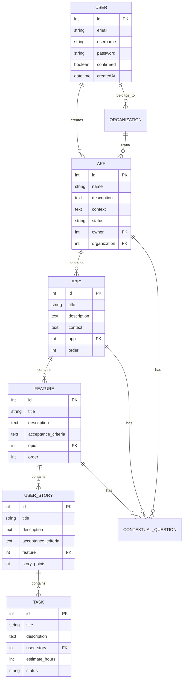

# Spec Tree - Software Design Document

## Document Control

| Field | Value |
|-------|-------|
| **Version** | 1.0.0 |
| **Last Updated** | January 16, 2026 |
| **Status** | In Progress |
| **Author** | Daniel Hernandez |
| **Repository** | https://github.com/dmhernandez2525/spec-tree |

---

## Table of Contents

1. [Executive Summary](#1-executive-summary)
2. [System Architecture](#2-system-architecture)
3. [Feature Inventory & Status](#3-feature-inventory--status)
4. [Technical Stack](#4-technical-stack)
5. [Database Schema](#5-database-schema)
6. [API Specification](#6-api-specification)
7. [Implementation Roadmap](#7-implementation-roadmap)
8. [Testing & Quality Assurance](#8-testing--quality-assurance)
9. [Security Considerations](#9-security-considerations)
10. [Performance Requirements](#10-performance-requirements)
11. [Deployment Strategy](#11-deployment-strategy)
12. [Risk Assessment](#12-risk-assessment)
13. [Appendices](#13-appendices)

---

## 1. Executive Summary

### 1.1 Project Overview

Spec Tree is an AI-powered project management and specification generation platform that transforms ideas into structured, actionable work items. The system uses artificial intelligence to break down complex projects into hierarchical components with comprehensive context at every level.

**Hierarchy Model:**
```
Apps (Projects)
└── Epics (Major Initiatives)
    └── Features (Specific Functionality)
        └── User Stories (User Requirements)
            └── Tasks (Implementation Steps)
```

**Key Value Propositions:**
- AI-driven work breakdown structure generation
- Context propagation through hierarchy (parent context flows to children)
- Multi-provider AI integration (currently OpenAI, with room for Anthropic/Gemini)
- Comprehensive project analytics and tracking
- Reusable templates and knowledge base

### 1.2 Project Metrics

| Metric | Value |
|--------|-------|
| **Codebase Size** | 350+ TypeScript/JavaScript files |
| **Total Commits** | 77 |
| **Development Period** | December 5, 2024 - January 16, 2026 |
| **Primary Developer** | Daniel Hernandez |
| **License** | MIT |

### 1.3 Current Status

| Aspect | Status |
|--------|--------|
| **Version** | 1.0.0-beta |
| **Deployment Status** | Development (Render configured) |
| **Production Ready** | ~65% (estimated) |
| **Brand Cleanup** | ✅ Complete |
| **Tailwind CSS v4** | ✅ Complete |
| **ESLint Warnings** | ✅ 0 warnings |

### 1.4 Technology Stack Summary

| Layer | Technology |
|-------|------------|
| **Frontend** | Next.js 14.2.35, React 18, TypeScript 5 |
| **Styling** | Tailwind CSS 4.1.18, shadcn/ui |
| **State Management** | Redux Toolkit 2.4.0 |
| **Backend CMS** | Strapi 5.0.0-beta.16 |
| **Database** | PostgreSQL 14+ |
| **AI Integration** | OpenAI SDK 4.24.1 (via Microservice) |
| **Deployment** | Render (Infrastructure as Code) |

### 1.5 Business Goals

1. **Portfolio Showcase** - Demonstrate AI integration and full-stack expertise
2. **SaaS Product** - Project management tool for development teams
3. **Best Practices** - Showcase modern web development patterns
4. **Knowledge Base** - Build reusable templates and workflows

---

## 2. System Architecture

### 2.1 High-Level Architecture

```
┌──────────────────────────────────────────────────────────────────────┐
│                         CLIENT (Next.js 14)                          │
│                         Port: 3000 (dev)                             │
│  ┌──────────────────┐  ┌──────────────────┐  ┌────────────────────┐  │
│  │    Marketing     │  │   Auth System    │  │ Dashboard/Builder  │  │
│  │   10+ pages      │  │   5 routes       │  │   6+ sections      │  │
│  └──────────────────┘  └──────────────────┘  └────────────────────┘  │
└─────────────┬─────────────────────────────────────┬──────────────────┘
              │ REST API                            │ REST API
              │                                     │
    ┌─────────▼─────────────────┐     ┌────────────▼─────────────────┐
    │    STRAPI SERVER          │     │    AI MICROSERVICE           │
    │    Port: 1337 (dev)       │     │    Port: 3001 (dev)          │
    │                           │     │                              │
    │  • 18 Content Types       │     │  • OpenAI Proxy              │
    │  • Users & Permissions    │     │  • Rate Limiting             │
    │  • Media Library          │     │  • Request Validation        │
    │  • Email (SendGrid)       │     │  • Response Processing       │
    │  • S3 Upload Provider     │     │                              │
    └───────────┬───────────────┘     └──────────────────────────────┘
                │
       ┌────────▼──────────┐
       │    PostgreSQL     │
       │    Database       │
       │                   │
       │  • Users          │
       │  • Apps           │
       │  • Epics          │
       │  • Features       │
       │  • User Stories   │
       │  • Tasks          │
       │  • Organizations  │
       └───────────────────┘
```

### 2.2 Service Descriptions

#### 2.2.1 Client (Next.js Frontend)

| Aspect | Details |
|--------|---------|
| **Purpose** | User interface and interaction layer |
| **Location** | `/Client` |
| **Port** | 3000 (development) |
| **Key Features** | Server-side rendering (SSR), App Router architecture, Real-time updates, Responsive design |

**Route Groups:**
- `(auth)` - Authentication flows (login, register, password reset)
- `(dashboard)` - Protected user dashboard and Spec Tree builder
- `(marketing)` - Public marketing pages
- `(legal)` - Legal pages (terms, privacy, cookies)

#### 2.2.2 Server (Strapi CMS)

| Aspect | Details |
|--------|---------|
| **Purpose** | Content management and data persistence |
| **Location** | `/Server` |
| **Port** | 1337 (development) |
| **Version** | 5.0.0-beta.16 |

**Key Features:**
- RESTful API (primary)
- GraphQL API (via plugin)
- JWT Authentication
- Role-based permissions
- Media library with S3 support
- Email via SendGrid

**Content Types (18 total):**
- Core: `app`, `epic`, `feature`, `user-story`, `task`
- Support: `organization`, `contextual-question`, `support-ticket`
- Marketing: `home-page`, `about-page`, `blog-page`, `blog-post`, `contact-page`
- Legal: `privacy-page`, `terms-page`, `cookies-page`
- Layout: `navbar`, `footer`

#### 2.2.3 Microservice (AI Integration)

| Aspect | Details |
|--------|---------|
| **Purpose** | AI provider abstraction and secure API key management |
| **Location** | `/Microservice` |
| **Port** | 3001 (development) |
| **Framework** | Express.js 4.18.2 |

**Key Features:**
- OpenAI API proxy
- Rate limiting (express-rate-limit)
- Request validation (express-validator)
- Security headers (helmet)
- Request logging (morgan)

**Current Provider Support:**
- ✅ OpenAI (GPT-4, GPT-3.5-turbo)
- ❌ Anthropic (Claude) - Not implemented
- ❌ Google (Gemini) - Not implemented

### 2.3 Directory Structure

```
spec-tree/
├── Client/                    # Next.js 14 frontend application
│   ├── app/                   # Next.js App Router
│   │   ├── (auth)/           # Authentication routes
│   │   │   ├── login/
│   │   │   ├── register/
│   │   │   ├── forgot-password/
│   │   │   ├── forgot-password-update/
│   │   │   └── email-confirmation/
│   │   ├── (dashboard)/      # Protected dashboard routes
│   │   │   └── user-dashboard/
│   │   │       ├── analytics/
│   │   │       ├── organization/
│   │   │       ├── profile/
│   │   │       ├── settings/
│   │   │       ├── spec-tree/
│   │   │       └── support/
│   │   ├── (marketing)/      # Marketing pages
│   │   │   ├── about/
│   │   │   ├── blog/
│   │   │   ├── careers/
│   │   │   ├── contact/
│   │   │   ├── demo/
│   │   │   ├── features/
│   │   │   ├── our-process/
│   │   │   ├── pricing/
│   │   │   ├── resources/
│   │   │   └── solutions/
│   │   └── (legal)/          # Legal pages
│   ├── components/           # React components (230+ files)
│   │   ├── ui/              # shadcn/ui components (49)
│   │   ├── spec-tree/       # Spec Tree builder (59 components)
│   │   ├── dashboard/       # Dashboard components (57)
│   │   ├── marketing/       # Marketing components (46)
│   │   ├── auth/            # Auth components (5)
│   │   ├── layout/          # Layout components (6)
│   │   └── shared/          # Shared components (5)
│   ├── lib/                  # Utilities (33 files)
│   │   ├── store/           # Redux store and slices
│   │   ├── hooks/           # Custom React hooks
│   │   └── utils/           # Utility functions
│   ├── types/               # TypeScript type definitions (17)
│   ├── api/                 # API client utilities
│   └── public/              # Static assets
│
├── Server/                   # Strapi CMS backend
│   ├── config/              # Strapi configuration
│   ├── src/
│   │   ├── api/             # Content type definitions (18)
│   │   ├── components/      # Strapi components
│   │   └── extensions/      # Core extensions
│   ├── database/            # Database files (SQLite for dev)
│   └── types/               # TypeScript types
│
├── Microservice/            # AI integration service
│   ├── src/
│   │   ├── controllers/     # Express controllers
│   │   ├── routes/          # API routes
│   │   ├── services/        # Business logic (AI calls)
│   │   ├── middleware/      # Express middleware
│   │   ├── config/          # Configuration
│   │   └── types/           # TypeScript types
│   └── tsconfig.json
│
├── docs/                    # Documentation (19 files)
├── reference/               # Templates and patterns (7 files)
├── render.yaml              # Render deployment config
├── README.md                # Project README
└── SOFTWARE_DESIGN_DOCUMENT.md  # This document
```

### 2.4 Data Flow Diagrams

#### 2.4.1 User Creates Work Item with AI

```
┌──────┐    ┌──────────┐    ┌─────────────┐    ┌────────────┐
│ User │───▶│ Client   │───▶│ Microservice│───▶│ OpenAI API │
└──────┘    │ (Next.js)│    │ (Express)   │    └────────────┘
            └────┬─────┘    └──────┬──────┘           │
                 │                 │                   │
                 │                 ◀───────────────────┘
                 │                 │ AI Response
                 │    ┌────────────▼──────────┐
                 └───▶│     Strapi Server     │
                      │   (Save to Database)  │
                      └───────────────────────┘
```

#### 2.4.2 Authentication Flow

```
┌──────┐    ┌──────────┐    ┌─────────────────┐    ┌──────────┐
│ User │───▶│ Client   │───▶│  Strapi Auth    │───▶│ Database │
└──────┘    │ (Login)  │    │  /api/auth/local│    └──────────┘
            └────┬─────┘    └────────┬────────┘
                 │                   │
                 │    ◀──────────────┘
                 │    JWT Token
                 │
            ┌────▼─────┐
            │  Redux   │
            │  Store   │
            │(auth-slice)
            └──────────┘
```

---

## 3. Feature Inventory & Status

### Status Legend

| Symbol | Meaning |
|--------|---------|
| ✅ | **Complete** - Fully implemented and tested |
| 🟨 | **Partial** - Implemented but incomplete |
| 🔴 | **Stub** - Placeholder only |
| ❌ | **Broken** - Non-functional |
| 📋 | **Planned** - Not started |

---

### 3.1 Authentication System

| Feature | Status | Location | Notes |
|---------|--------|----------|-------|
| User Registration | 🟨 | `/app/(auth)/register` | Form works, email verification TBD |
| User Login | ✅ | `/app/(auth)/login` | JWT auth working |
| Password Reset Request | 🟨 | `/app/(auth)/forgot-password` | Form exists, email TBD |
| Password Reset Update | 🟨 | `/app/(auth)/forgot-password-update` | Form exists |
| Email Confirmation | 🔴 | `/app/(auth)/email-confirmation` | Page exists, functionality TBD |
| JWT Token Handling | ✅ | `lib/store/auth-slice.ts` | Working |
| Protected Routes | ✅ | `app/(dashboard)/layout.tsx` | Working |

**Auth System Checklist:**
- [x] Login form and API integration
- [x] Registration form and API integration
- [x] JWT token storage and refresh
- [x] Protected route middleware
- [x] Logout functionality
- [ ] Email verification flow
- [ ] Password reset email sending
- [ ] Remember me option
- [ ] Social login (OAuth)

---

### 3.2 Spec Tree Builder (Core Feature)

| Feature | Status | Location | Notes |
|---------|--------|----------|-------|
| App/Project CRUD | 🟨 | `components/spec-tree/` | Basic CRUD works |
| Epic CRUD | 🟨 | `components/spec-tree/components/` | Basic CRUD works |
| Feature CRUD | 🟨 | `components/spec-tree/components/` | Basic CRUD works |
| User Story CRUD | 🟨 | `components/spec-tree/components/` | Basic CRUD works |
| Task CRUD | 🟨 | `components/spec-tree/components/` | Basic CRUD works |
| Hierarchy Visualization | 🟨 | `components/spec-tree/index.tsx` | Tree view implemented |
| AI Assistant | 🟨 | Via Microservice | OpenAI integration working |
| Context Propagation | 🟨 | `components/spec-tree/lib/` | Partial implementation |
| Drag & Drop | 🔴 | react-beautiful-dnd | Installed, not fully wired |
| Templates | 📋 | - | Not implemented |

**Spec Tree Builder Checklist:**
- [x] Create work items (App, Epic, Feature, Story, Task)
- [x] Read/view work items
- [x] Update work items
- [x] Delete work items
- [x] Tree hierarchy display
- [x] Expand/collapse nodes
- [x] Context gathering questionnaire
- [x] AI-assisted breakdown (OpenAI)
- [ ] Drag-and-drop reordering
- [ ] Context inheritance (parent → child)
- [ ] Template system
- [ ] Import from CSV/JSON
- [ ] Export to CSV/JSON

---

### 3.3 Dashboard Features

| Feature | Status | Location | Notes |
|---------|--------|----------|-------|
| Overview/Home | ✅ | `/user-dashboard/page.tsx` | Working |
| Analytics | 🟨 | `/user-dashboard/analytics/` | Charts implemented, some TODOs |
| Organization Management | 🔴 | `/user-dashboard/organization/` | UI exists, API TODOs |
| User Profile | 🟨 | `/user-dashboard/profile/` | Basic profile editing |
| Settings | 🟨 | `/user-dashboard/settings/` | Multiple TODOs |
| Support | 🔴 | `/user-dashboard/support/` | Ticket form, API TBD |
| Spec Tree | ✅ | `/user-dashboard/spec-tree/` | Main builder |

**Organization Management Details:**
- [ ] Invite users (TODO in code)
- [ ] Role management (TODO in code)
- [ ] Member removal (TODO in code)
- [ ] Organization settings update (TODO in code)

**Settings Details:**
- [ ] AI settings update (TODO in code)
- [ ] Integration connections (TODO in code)
- [ ] SSO configuration (TODO in code)

---

### 3.4 Marketing Pages

| Page | Status | Location | Notes |
|------|--------|----------|-------|
| Homepage | ✅ | `/app/(marketing)/page.tsx` | Hero, features, CTA |
| About | ✅ | `/app/(marketing)/about/` | Team, mission |
| Features | ✅ | `/app/(marketing)/features/` | Feature showcase |
| Pricing | ✅ | `/app/(marketing)/pricing/` | Tier comparison |
| Contact | 🔴 | `/app/(marketing)/contact/` | Form, API TBD |
| Blog | 🔴 | `/app/(marketing)/blog/` | Structure exists, content TBD |
| Careers | 🔴 | `/app/(marketing)/careers/` | TODO: API fetch |
| Demo | 🔴 | `/app/(marketing)/demo/` | Page exists |
| Our Process | 🟨 | `/app/(marketing)/our-process/` | Content exists |
| Resources | 🔴 | `/app/(marketing)/resources/` | TODO: API fetch |
| Solutions | 🟨 | `/app/(marketing)/solutions/` | Dynamic routes |

---

### 3.5 Legal Pages

| Page | Status | Location |
|------|--------|----------|
| Terms of Service | 🟨 | `/app/(legal)/terms/` |
| Privacy Policy | 🟨 | `/app/(legal)/privacy/` |
| Cookies Policy | 🟨 | `/app/(legal)/cookies/` |

---

### 3.6 Feature Summary Statistics

| Category | Complete (✅) | Partial (🟨) | Stub (🔴) | Planned (📋) | Total |
|----------|--------------|--------------|-----------|--------------|-------|
| Auth | 3 | 3 | 1 | 0 | 7 |
| Spec Tree Builder | 0 | 8 | 1 | 1 | 10 |
| Dashboard | 2 | 3 | 2 | 0 | 7 |
| Marketing | 3 | 3 | 5 | 0 | 11 |
| Legal | 0 | 3 | 0 | 0 | 3 |
| **Total** | **8** | **20** | **9** | **1** | **38** |

**Overall Completion:**
```
[========================>           ] ~65% Complete
Complete: 8 features (21%)
Partial:  20 features (53%)
Stub:     9 features (24%)
Planned:  1 feature (3%)
```

---

## 4. Technical Stack

### 4.1 Frontend Stack

#### 4.1.1 Next.js 14

| Aspect | Details |
|--------|---------|
| **Version** | 14.2.35 |
| **Router** | App Router |
| **Rendering** | SSR + CSR hybrid |
| **Config** | `next.config.mjs` |

**Key Features Used:**
- Server Components
- Client Components
- Route Groups
- Metadata API
- Image optimization
- API routes (minimal - most in Strapi)

#### 4.1.2 React 18

| Aspect | Details |
|--------|---------|
| **Version** | 18.x |
| **Hooks Used** | useState, useEffect, useCallback, useMemo, useContext, useReducer |
| **Custom Hooks** | Located in `lib/hooks/` |

#### 4.1.3 TypeScript

| Aspect | Details |
|--------|---------|
| **Version** | 5.x |
| **Strictness** | Strict mode enabled |
| **Config** | `tsconfig.json` |
| **Type Definitions** | `types/` directory |

#### 4.1.4 Tailwind CSS v4

| Aspect | Details |
|--------|---------|
| **Version** | 4.1.18 |
| **Config** | `tailwind.config.ts`, `app/globals.css` |
| **PostCSS Plugin** | `@tailwindcss/postcss` |

**Customizations:**
- Custom color palette (oklch colors)
- Dark mode support
- Custom animations via `tailwindcss-animate`

#### 4.1.5 shadcn/ui

| Aspect | Details |
|--------|---------|
| **Components** | 49 components in `components/ui/` |
| **Config** | `components.json` |
| **Icons** | lucide-react, @radix-ui/react-icons |

**Components Used:**
accordion, alert-dialog, aspect-ratio, avatar, button, card, checkbox, collapsible, command, context-menu, dialog, dropdown-menu, hover-card, input, label, menubar, navigation-menu, popover, progress, radio-group, scroll-area, select, separator, skeleton, slider, switch, table, tabs, textarea, toast, toggle, toggle-group, tooltip, etc.

#### 4.1.6 State Management

**Redux Toolkit:**

| Slice | Purpose |
|-------|---------|
| `auth-slice` | Authentication state, JWT tokens |
| `user-slice` | User profile data |
| `sow-slice` | Statement of Work / Spec Tree data |
| `subscription-slice` | Subscription status |

#### 4.1.7 Form Handling

| Library | Version | Purpose |
|---------|---------|---------|
| react-hook-form | 7.53.1 | Form state management |
| @hookform/resolvers | 3.9.1 | Validation integration |
| zod | 3.23.8 | Schema validation |

#### 4.1.8 Other Frontend Libraries

| Library | Version | Purpose |
|---------|---------|---------|
| framer-motion | 11.13.1 | Animations |
| recharts | 2.13.0 | Data visualization |
| react-beautiful-dnd | 13.1.1 | Drag and drop |
| react-dnd | 16.0.1 | Alternative DnD |
| date-fns | 3.6.0 | Date formatting |
| axios | 1.7.9 | HTTP client |
| marked | 15.0.3 | Markdown parsing |
| canvas-confetti | 1.9.3 | Celebrations |
| sonner | 1.5.0 | Toast notifications |

### 4.2 Backend Stack (Strapi)

#### 4.2.1 Strapi Version

| Aspect | Details |
|--------|---------|
| **Current Version** | 5.0.0-beta.16 |
| **Latest Stable** | ~5.x (check npm) |
| **Status** | Beta version - consider upgrade |

> ⚠️ **Warning:** Running beta version of Strapi. Should upgrade to latest stable for production.

#### 4.2.2 Strapi Plugins

| Plugin | Version | Purpose |
|--------|---------|---------|
| @strapi/plugin-users-permissions | 5.0.0-beta.16 | Authentication |
| @strapi/plugin-documentation | 5.0.0-beta.16 | API docs |
| @strapi/plugin-cloud | 5.0.0-beta.16 | Cloud features |
| @strapi/provider-email-sendgrid | 5.0.0-beta.17 | Email |
| @strapi/provider-upload-aws-s3 | 4.25.4 | File uploads |

#### 4.2.3 Content Types

| Content Type | Fields | Purpose |
|--------------|--------|---------|
| `app` | name, description, context, etc. | Project container |
| `epic` | title, description, context, app relation | Major initiative |
| `feature` | title, description, epic relation | Functional capability |
| `user-story` | title, acceptance criteria, feature relation | User requirement |
| `task` | title, estimate, user-story relation | Implementation step |
| `organization` | name, members, settings | Team/org |
| `contextual-question` | question, response, work-item | AI context |
| `support-ticket` | subject, description, status | Support system |

### 4.3 AI Microservice Stack

#### 4.3.1 Express.js

| Aspect | Details |
|--------|---------|
| **Version** | 4.18.2 |
| **TypeScript** | Yes (ts-node, nodemon) |
| **Build** | TypeScript → dist/ |

#### 4.3.2 Middleware

| Middleware | Purpose |
|------------|---------|
| cors | Cross-origin requests |
| helmet | Security headers |
| morgan | Request logging |
| express-rate-limit | Rate limiting |
| express-validator | Request validation |

#### 4.3.3 AI SDK

| Provider | Package | Version | Status |
|----------|---------|---------|--------|
| OpenAI | openai | 4.24.1 | ✅ Implemented |
| Anthropic | - | - | ❌ Not installed |
| Google | - | - | ❌ Not installed |

### 4.4 Database

| Aspect | Details |
|--------|---------|
| **Database** | PostgreSQL |
| **Version** | 14+ |
| **Driver** | pg 8.8.0 |
| **ORM** | Strapi (Knex.js internally) |
| **Dev Config** | SQLite alternative available |

### 4.5 Development Tools

#### 4.5.1 Linting & Formatting

| Tool | Config |
|------|--------|
| ESLint | `.eslintrc.json` |
| ESLint Config | eslint-config-next 14.2.35 |
| Prettier | In Microservice only |

#### 4.5.2 Type Checking

```bash
# Client
npm run type-check  # tsc --noEmit

# Microservice
npm run build       # tsc
```

### 4.6 Deployment Stack

| Service | Target | Config |
|---------|--------|--------|
| Client | Render Web Service | `render.yaml` |
| Server | Render Web Service | `render.yaml` |
| Microservice | Render Web Service | `render.yaml` |
| Database | Render PostgreSQL (free tier) | `render.yaml` |

**Deployment Configuration:** See `render.yaml` for Infrastructure as Code setup.

---

## 5. Database Schema

### 5.1 Core Entities (Strapi Content Types)



### 5.2 Strapi Content Type Locations

| Content Type | Schema Location |
|--------------|-----------------|
| app | `Server/src/api/app/content-types/app/schema.json` |
| epic | `Server/src/api/epic/content-types/epic/schema.json` |
| feature | `Server/src/api/feature/content-types/feature/schema.json` |
| user-story | `Server/src/api/user-story/content-types/user-story/schema.json` |
| task | `Server/src/api/task/content-types/task/schema.json` |

---

## 6. API Specification

### 6.1 Strapi REST API

**Base URL:** `http://localhost:1337/api` (development)

#### 6.1.1 Authentication Endpoints

| Endpoint | Method | Purpose |
|----------|--------|---------|
| `/auth/local` | POST | Login with email/password |
| `/auth/local/register` | POST | Create new user |
| `/auth/forgot-password` | POST | Request password reset |
| `/auth/reset-password` | POST | Reset password with token |
| `/auth/email-confirmation` | GET | Confirm email |

#### 6.1.2 Content Type Endpoints

| Resource | Endpoints |
|----------|-----------|
| Apps | `GET/POST /apps`, `GET/PUT/DELETE /apps/:id` |
| Epics | `GET/POST /epics`, `GET/PUT/DELETE /epics/:id` |
| Features | `GET/POST /features`, `GET/PUT/DELETE /features/:id` |
| User Stories | `GET/POST /user-stories`, `GET/PUT/DELETE /user-stories/:id` |
| Tasks | `GET/POST /tasks`, `GET/PUT/DELETE /tasks/:id` |

### 6.2 AI Microservice API

**Base URL:** `http://localhost:3001` (development)

| Endpoint | Method | Purpose |
|----------|--------|---------|
| `/api/chat` | POST | Send prompt to OpenAI |
| `/api/complete` | POST | Generate completion |
| `/api/health` | GET | Service health check |

---

## 7. Implementation Roadmap

### 7.1 Phase 1: Core Stability (Current)

- [x] Brand cleanup complete
- [x] Tailwind v4 upgrade
- [x] ESLint warnings fixed
- [ ] Complete all auth flows
- [ ] Fix organization management TODOs
- [ ] Fix settings TODOs

### 7.2 Phase 2: Feature Completion

- [ ] Complete drag-and-drop in Spec Tree
- [ ] Implement context propagation
- [ ] Add template system
- [ ] Complete analytics dashboard
- [ ] Add import/export (CSV, JSON)

### 7.3 Phase 3: AI Enhancement

- [ ] Add Anthropic (Claude) support
- [ ] Add Google (Gemini) support
- [ ] Implement provider selection UI
- [ ] Add cost tracking
- [ ] Implement fallback logic

### 7.4 Phase 4: Production Readiness

- [ ] Upgrade Strapi to stable release
- [ ] Configure email service (SendGrid)
- [ ] Complete all marketing pages
- [ ] Add comprehensive error handling
- [ ] Performance optimization
- [ ] Security audit

### 7.5 Phase 5: Advanced Features

- [ ] Real-time collaboration
- [ ] Team workspaces
- [ ] Jira/Linear integration
- [ ] Mobile application

---

## 8. Testing & Quality Assurance

### 8.1 Current Test Coverage

| Component | Test Framework | Coverage |
|-----------|---------------|----------|
| Client | None configured | 0% |
| Server | Strapi built-in | Minimal |
| Microservice | Jest | Minimal |

### 8.2 Testing Strategy (Recommended)

| Test Type | Tool | Purpose |
|-----------|------|---------|
| Unit Tests | Jest, Testing Library | Component/function testing |
| Integration Tests | Jest, Supertest | API testing |
| E2E Tests | Playwright/Cypress | User flow testing |
| Type Checking | TypeScript compiler | Static analysis |
| Linting | ESLint | Code quality |

### 8.3 Verification Commands

```bash
# Client
npm run build      # Build verification
npm run type-check # Type verification
npm run lint       # Lint verification

# Microservice
npm run build      # TypeScript compilation
npm run test       # Jest tests
npm run lint       # ESLint
```

---

## 9. Security Considerations

### 9.1 Authentication & Authorization

| Aspect | Implementation |
|--------|----------------|
| Authentication | JWT tokens via Strapi |
| Token Storage | Client-side (localStorage/cookies) |
| Password Hashing | bcrypt (Strapi default) |
| Route Protection | Dashboard layout middleware |
| API Authorization | Strapi permissions plugin |

### 9.2 API Security

| Aspect | Implementation |
|--------|----------------|
| HTTPS | Required for production |
| CORS | Configured in both Strapi and Microservice |
| Rate Limiting | express-rate-limit in Microservice |
| Input Validation | Zod (Client), express-validator (Microservice) |
| Security Headers | Helmet.js in Microservice |

### 9.3 Secrets Management

| Secret | Location | Notes |
|--------|----------|-------|
| JWT_SECRET | Server/.env | Generate unique value |
| OPENAI_API_KEY | Microservice/.env | Never expose to client |
| STRAPI_TOKEN | Client/.env.local | API token for Strapi |
| DATABASE_PASSWORD | Server/.env | Strong password required |
| STRIPE_SECRET_KEY | Not in codebase | For payments |

### 9.4 Security TODOs

- [ ] Implement CSRF protection
- [ ] Add request signing for Microservice
- [ ] Implement API key rotation
- [ ] Add audit logging
- [ ] Security penetration testing

---

## 10. Performance Requirements

### 10.1 Target Metrics

| Metric | Target | Notes |
|--------|--------|-------|
| Time to First Byte (TTFB) | < 200ms | Server response |
| First Contentful Paint (FCP) | < 1.5s | Core Web Vitals |
| Largest Contentful Paint (LCP) | < 2.5s | Core Web Vitals |
| Cumulative Layout Shift (CLS) | < 0.1 | Core Web Vitals |
| First Input Delay (FID) | < 100ms | Core Web Vitals |

### 10.2 Optimization Strategies

- **Next.js:** Automatic code splitting, image optimization
- **React:** Lazy loading, memoization
- **Database:** Query optimization, connection pooling
- **CDN:** Static asset caching (via Render)
- **API:** Response caching where appropriate

---

## 11. Deployment Strategy

### 11.1 Environment Variables

#### Client (.env.local)

```env
NEXT_PUBLIC_STRAPI_API_URL=http://localhost:1337
NEXT_PUBLIC_STRAPI_TOKEN=your_strapi_api_token
NEXT_PUBLIC_MICROSERVICE_URL=http://localhost:3001
NEXT_PUBLIC_STRIPE_PUBLISHABLE_KEY=pk_test_xxx
```

#### Server (.env)

```env
HOST=0.0.0.0
PORT=1337
DATABASE_CLIENT=postgres
DATABASE_HOST=127.0.0.1
DATABASE_PORT=5432
DATABASE_NAME=spec_tree
DATABASE_USERNAME=
DATABASE_PASSWORD=
JWT_SECRET=your_jwt_secret
```

#### Microservice (.env)

```env
OPENAI_API_KEY=sk-xxx
PORT=3001
```

### 11.2 Render Deployment

All services configured in `render.yaml` for one-click deployment:

| Service | Type | Plan |
|---------|------|------|
| spec-tree-client | Web Service | Free |
| spec-tree-server | Web Service | Free |
| spec-tree-microservice | Web Service | Free |
| spec-tree-db | PostgreSQL | Free |

### 11.3 Deployment Commands

```bash
# Build for production
cd Client && npm run build
cd Server && npm run build
cd Microservice && npm run build

# Start production
cd Client && npm start
cd Server && npm start
cd Microservice && npm start
```

---

## 12. Risk Assessment

### 12.1 Technical Risks

| Risk | Likelihood | Impact | Mitigation |
|------|------------|--------|------------|
| Strapi beta instability | Medium | High | Upgrade to stable release |
| OpenAI API rate limits | Medium | Medium | Implement caching, fallback providers |
| Database performance | Low | High | Query optimization, indexing |
| Third-party dependency vulnerabilities | Medium | Medium | Regular dependency updates |

### 12.2 Business Risks

| Risk | Likelihood | Impact | Mitigation |
|------|------------|--------|------------|
| AI API cost overruns | Medium | Medium | Usage tracking, limits, user quotas |
| Feature creep | High | Medium | Strict roadmap adherence |
| User adoption | Unknown | High | Quality marketing, onboarding |

### 12.3 Operational Risks

| Risk | Likelihood | Impact | Mitigation |
|------|------------|--------|------------|
| Service downtime | Low | High | Monitoring, alerting |
| Data loss | Low | Critical | Regular backups, replication |
| Security breach | Low | Critical | Security audit, best practices |

---

## 13. Appendices

### Appendix A: TODO Inventory

**Total TODOs Found:** 30+

**By Category:**

| Category | Count | Priority |
|----------|-------|----------|
| API refactoring (fetchData.ts) | 15 | P2-P3 |
| Organization features | 5 | P1 |
| Settings features | 4 | P2 |
| Marketing pages | 3 | P3 |
| Analytics | 1 | P3 |
| Payments | 1 | P2 |

**High Priority TODOs (P1):**
- `OrganizationManagement.tsx:27` - Organization role implementation
- `MemberManagement.tsx:74` - Role update API
- `MemberManagement.tsx:96` - Member removal API
- `InviteUsers.tsx:143` - Resend invite functionality
- `OrganizationManagement.tsx:58` - Organization update

### Appendix B: File Statistics

| Metric | Count |
|--------|-------|
| Total Client files | 352 |
| Total Server files | 141 |
| Total Microservice files | 18 |
| TypeScript files (Client) | ~250 |
| Component files | 230 |
| UI components (shadcn) | 49 |
| Spec Tree components | 59 |

### Appendix D: External Dependencies

**Client (Key Dependencies):**
- next@14.2.35
- react@18
- @reduxjs/toolkit@2.4.0
- tailwindcss@4.1.18
- zod@3.23.8
- axios@1.7.9
- framer-motion@11.13.1

**Server (Key Dependencies):**
- @strapi/strapi@5.0.0-beta.16
- pg@8.8.0

**Microservice (Key Dependencies):**
- express@4.18.2
- openai@4.24.1
- helmet@7.1.0

---

## Document History

| Version | Date | Author | Changes |
|---------|------|--------|---------|
| 1.0.0 | 2026-01-16 | Daniel Hernandez | Initial SDD creation |

---

*This document is a living specification. Update as the project evolves.*
